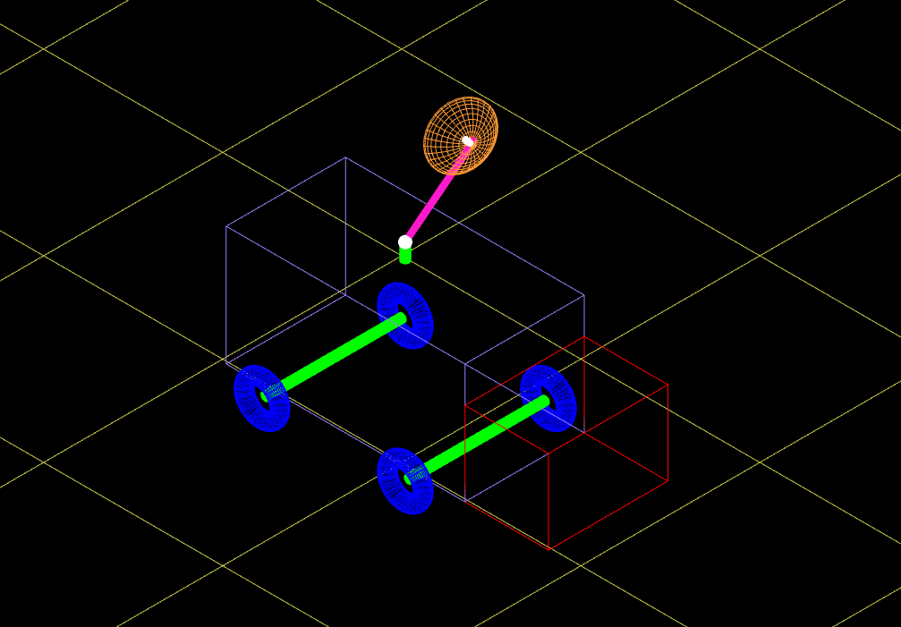

# GCI WebGL animation and modelling project

## Controls:
| Instruction | Key |
|-------------|-----|
| Forward     |<kbd>W</kbd>|
| Reverse     |<kbd>S</kbd>|
| Satelite Dish Up | <kbd>I</kbd>|
| Satelite Dish Down | <kbd>K</kbd>|
| Satelite Dish Rotate Anti-Clockwise | <kbd>J</kbd>|
| Satelite Dish Rotate Clockwise | <kbd>L</kbd>|
| Change Colours | <kbd>Space</kbd>
| Change View Mode| <kbd>0</kbd> to <kbd>3</kbd>|

## Running the project:
* Clone the project
 or
* Just go to the project website available [here](https://diogo-paulico.github.io/CGI-Animation-Modelling)

## Authors

* **Diogo Paulico** - *Initial work*
* **Daniel João** - *Initial Work*
